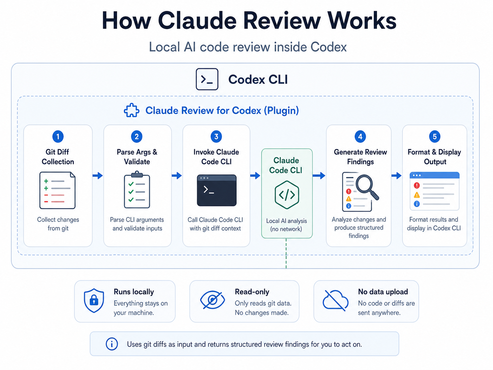
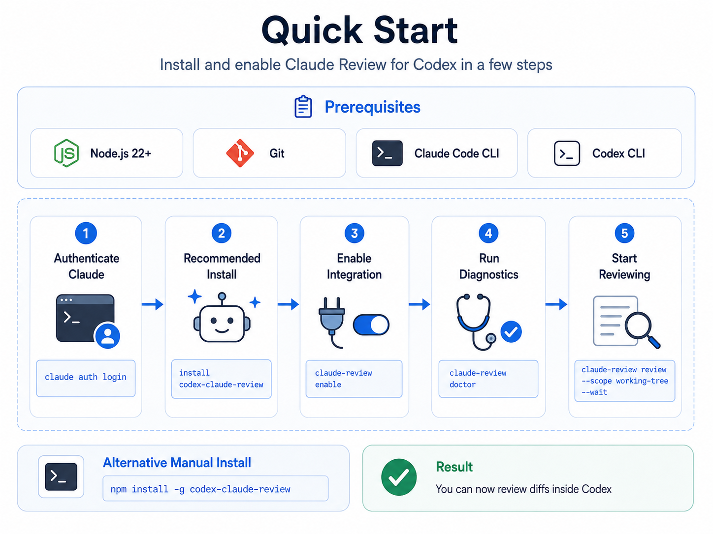
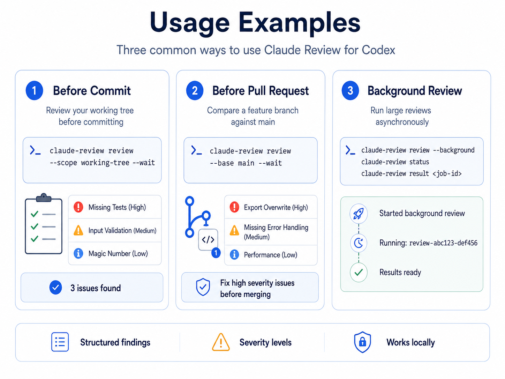

<div align="center">

# Claude Review for Codex

**Smart code review powered by Claude Code**

[](https://www.npmjs.com/package/codex-claude-review)
[](LICENSE)

**🌐 Language / 语言**

[English](./README.md) | [简体中文](./README_CN.md)

</div>

---

## Table of Contents

- [What is this?](#what-is-this)
- [How it works](#how-it-works)
- [Output Modes](#output-modes)
- [Prerequisites](#prerequisites)
- [Quick Start](#quick-start)
- [Usage Examples](#usage-examples)
- [Command Reference](#command-reference)
- [Security](#security)
- [License](#license)

---

## What is this?

Claude Review for Codex is a plugin that integrates Claude Code into Codex for intelligent code review.

| Use Case | Description |
|----------|-------------|
| Pre-commit Check | Review your changes before committing |
| PR Review | Compare branch diffs, get review feedback |
| Code Learning | Understand code quality and improvement suggestions |
| Security Scan | Detect potential vulnerabilities and performance issues |

---

## How it works



The diagram shows the default Claude Code CLI path. If Direct API fallback is enabled and used, the diff and prompt are sent to the configured Anthropic-compatible endpoint.

```
┌─────────────────────────────────────────────────────────────┐
│                        Codex CLI                            │
│  ┌───────────────────────────────────────────────────────┐  │
│  │              claude-review plugin                     │  │
│  │  ┌─────────────┐  ┌─────────────┐  ┌──────────────┐  │  │
│  │  │ git diff    │  │ parse args  │  │ format       │  │  │
│  │  │ collection  │→ │ & validate  │→ │ output       │  │  │
│  │  └─────────────┘  └─────────────┘  └──────────────┘  │  │
│  └───────────────────────────────────────────────────────┘  │
│                           ↓                                 │
│  ┌───────────────────────────────────────────────────────┐  │
│  │              Claude Code CLI                          │  │
│  │  ┌─────────────────────────────────────────────────┐  │  │
│  │  │  Analyze diff → Generate review findings        │  │  │
│  │  └─────────────────────────────────────────────────┘  │  │
│  └───────────────────────────────────────────────────────┘  │
└─────────────────────────────────────────────────────────────┘
```

**Workflow:**

1. **Collect changes** - Plugin uses `git diff` to collect your code changes
2. **Invoke Claude Code** - Sends the diff to Claude Code CLI for analysis
3. **Get results** - Claude Code returns structured review findings
4. **Display output** - Plugin formats and displays the results

**Key points:**
- Claude Code runs as a **background process** (subagent) within Codex
- Analysis is **local-first** through Claude Code CLI by default
- The plugin is **read-only** - it never modifies your code

---

## Output Modes

Claude Review supports two output modes:

| Mode | Flag | Description | Use Case |
|------|------|-------------|----------|
| **Text** (default) | `--format=text` | Markdown table output | Quick review, lightweight |
| **Interactive** | `--format=table` | HTML report with per-finding selection | Detailed review, batch actions |

### Text Mode (Default)

Outputs a clean Markdown table:

```markdown
| Severity | File | Issue | Suggestion |
|----------|------|-------|------------|
| P1 | src/app.js:42 | Missing null check | Add null check |
| P2 | src/utils.js:15 | Unused variable | Remove it |
```

### Interactive HTML Mode

Generates an interactive HTML report with:
- Color-coded severity levels (P0/P1 red, P2 yellow, P3 green)
- Per-finding action selection (Fix / Skip / Custom)
- Batch operations (Select All Fix, P3 → Skip, etc.)
- Export selections as JSON for automation

```bash
# Generate and open HTML report
claude-review review --wait --format=table --open
```

### Natural Language Triggers

When using with Codex, you can switch modes naturally:

| Say this | Result |
|----------|--------|
| "生成 HTML 报告" / "交互式确认" | Switches to interactive mode |
| "简单模式" / "直接看结果" | Uses text mode |

---

## Prerequisites

Before installing the plugin, make sure you have:

| Requirement | Install Command | Verify |
|-------------|-----------------|--------|
| Node.js 22+ | [Download](https://nodejs.org/) | `node --version` |
| Git | [Download](https://git-scm.com/) | `git --version` |
| Claude Code CLI | `npm install -g @anthropic-ai/claude-code` | `claude --version` |
| Codex CLI | [Install Guide](https://github.com/openai/codex) | `codex --version` |

**After installing Claude Code, authenticate:**

```bash
claude auth login
```

---

## Quick Start



### Option 1: Agent Install (Recommended)

Just say this in Codex:

```
install codex-claude-review
```

The agent will handle everything automatically.

### Option 2: Manual Install

```bash
# Install the plugin
npm install -g codex-claude-review

# Enable Codex integration (registers the package root as a local marketplace and installs the plugin)
claude-review enable

# Verify environment and dependencies
claude-review doctor
```

> **Note:** `enable` uses the Codex CLI to register the package root as a local marketplace and enable `claude-review@local-codex-plugins`.

---

## Usage Examples



### Example 1: Review your changes before committing

You made some changes and want to check them:

```bash
$ claude-review review --scope working-tree --wait
```

Output:

```
Code Review Findings

1. Missing Tests (High)
   File: src/utils.js:15
   New exported function "calculate" has no unit tests.
   Suggestion: Add tests for edge cases (negative numbers, zero, large values).

2. Input Validation (Medium)
   File: src/utils.js:18
   Function doesn't validate if inputs are numbers.
   Suggestion: Add type checking before calculation.

3. Magic Number (Low)
   File: src/utils.js:22
   Hard-coded value 100 should be a named constant.
   Suggestion: const MAX_RETRIES = 100;

Summary: 3 issues found (1 high, 1 medium, 1 low)
```

### Example 2: Review a branch before creating PR

You finished a feature branch and want to review it against main:

```bash
$ claude-review review --base main --wait
```

Output:

```
Code Review Findings

1. Bug: Export Overwrite (High)
   File: src/index.js:10
   First export "module.exports = { add }" is overwritten by second export.
   Fix: Combine into single export statement.

2. Missing Error Handling (Medium)
   File: src/api.js:45
   fetch() call has no error handling for network failures.
   Fix: Add try/catch or .catch() handler.

3. Performance (Low)
   File: src/render.js:78
   Array is recreated on every render cycle.
   Fix: Use useMemo to memoize the array.

Summary: 3 issues found. Consider fixing high severity issues before merging.
```

### Example 3: Run review in background

For large codebases, run the review in background:

```bash
# Start background review
$ claude-review review --background
Started background review: review-abc123-def456

# Check status later
$ claude-review status
Running: review-abc123-def456 (working tree diff)

# Get results when done
$ claude-review result review-abc123-def456
```

---

## Command Reference

| Command | Description |
|---------|-------------|
| `claude-review enable` | Enable Codex plugin integration |
| `claude-review doctor` | Check environment dependencies |
| `claude-review review` | Run code review |
| `claude-review status` | Show background job status |
| `claude-review result` | Show review results |
| `claude-review cancel` | Cancel a running job |

### Review Options

| Option | Description |
|--------|-------------|
| `--scope <type>` | Review scope: `working-tree`, `branch`, or `auto` (default) |
| `--base <ref>` | Base branch for comparison (e.g., `main`, `master`) |
| `--wait` | Wait for result in foreground |
| `--background` | Run in background (default) |
| `--timeout <min>` | Timeout in minutes (default: 30) |
| `--format <mode>` | Output format: `text` (default) or `table` (interactive HTML) |
| `--output <dir>` | Output directory for HTML reports (default: `.claude-review/`) |
| `--open` | Auto-open HTML report in browser |
| `--json` | JSON output format (best-effort; falls back to raw text if parsing fails) |

---

## Security

- **Read-only** - Plugin never modifies your code
- **Local-first** - By default, analysis runs locally via Claude Code CLI
- **Direct API fallback** - When the Claude CLI cannot be reached, the plugin may fall back to a configured Anthropic-compatible API endpoint. In this mode, your diff and prompt are sent to the remote endpoint. Set `CLAUDE_REVIEW_FORCE_CLAUDE_CLI=1` to disable fallback entirely
- **Git-only** - Only works with Git repositories

---

## License

MIT
